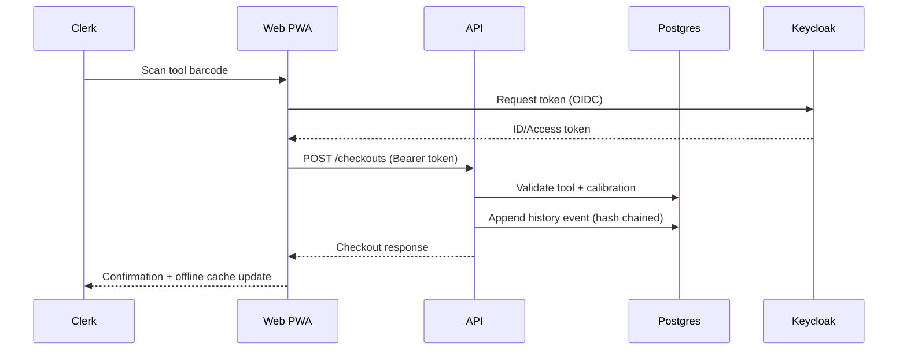

# Tool Jockey Monorepo

Tool Jockey is a tool control and calibration management platform for aerospace MRO teams. This monorepo contains the NestJS API, Next.js PWA, shared UI kit, and infrastructure tooling required for local development and CI.

## Architecture Overview
```mermaid
flowchart LR
  subgraph Client
    Web[Next.js PWA]
  end
  subgraph Services
    API[NestJS API]
    Queue[(Redis / BullMQ)]
  end
  subgraph Data
    DB[(PostgreSQL)]
    Object[MinIO (S3)]
    Metabase
  end
  subgraph Identity
    Keycloak
  end
  Web <---> API
  API <--> DB
  API --> Object
  API --> Queue
  API --> Metabase
  Web --> Keycloak
```



## Tech Stack
- **Package manager:** pnpm
- **Monorepo tooling:** Turborepo
- **API:** NestJS 10, Prisma ORM, PostgreSQL, BullMQ
- **Web:** Next.js 15 (App Router), Tailwind CSS, TanStack Query, Dexie
- **Infra (dev):** Docker Compose (Postgres, Redis, Keycloak, MinIO, Metabase)
- **Testing:** Jest (unit), Playwright (e2e), k6 (perf smoke)

## Workspaces
- `apps/api` – NestJS backend
- `apps/web` – Next.js PWA
- `packages/ui` – shared React components
- `packages/types` – shared TypeScript types
- `packages/config` – lint/format/ts/jest configs
- `tests/e2e` – Playwright specs
- `tests/perf` – k6 scripts
- `infra/docker` – docker-compose stack
- `scripts` – developer automation (verify, dev, ci, db-reset)

## Getting Started
1. **Install dependencies**
   ```bash
   pnpm install
   ```
2. **Copy environment files**
   ```bash
   cp apps/api/.env.example apps/api/.env
   cp apps/web/.env.example apps/web/.env.local
   ```
3. **Launch services + apps**
   ```bash
   ./scripts/dev.sh
   ```
   - API: http://localhost:3000
   - Web PWA: http://localhost:3001 (Next dev server)
   - Keycloak: http://localhost:8080 (admin/admin)
   - MinIO: http://localhost:9001 (minioadmin/minioadmin)
   - Metabase: http://localhost:3002

### Verification Pipeline
Run the same checks as CI locally:
```bash
./scripts/verify.sh
```
This script lints, type-checks, builds, migrates, seeds, runs unit/e2e tests, and executes a short k6 smoke.

### Database Utilities
Reset database and reseed:
```bash
./scripts/db-reset.sh
```

## Testing Strategy
| Layer | Tool | Notes |
| --- | --- | --- |
| Unit | Jest | Domain services (checkout rules, history hash chain) |
| Integration | Supertest (pending) | Wire up in future iterations |
| E2E | Playwright | Dashboard load + workflow skeleton |
| Performance | k6 | Checkout health threshold `<300ms` |
| Security | OWASP ZAP (planned) | Placeholder stage in CI |

## Assumptions
- Keycloak tokens are proxied via the web app; local development uses fixed bearer tokens (`dev-*-token`).
- File uploads use MinIO with path-style requests; production would swap to AWS S3.
- Offline-first queue currently replays POST mutations with *server-wins* conflict policy.
- Thumbnail generation and background jobs are stubbed but ready for BullMQ integration.

## Troubleshooting
- **Prisma connection errors:** ensure Postgres from `infra/docker/docker-compose.yml` is running.
- **Playwright missing browsers:** run `npx playwright install` or re-run `./scripts/verify.sh` (auto-installs).
- **Keycloak not importing realm:** delete container volume `docker compose -f infra/docker/docker-compose.yml down -v` and re-up.

## Additional Docs
- [`apps/api/README.md`](apps/api/README.md)
- [`apps/web/README.md`](apps/web/README.md)
- [`docs/API.postman_collection.json`](docs/API.postman_collection.json)

